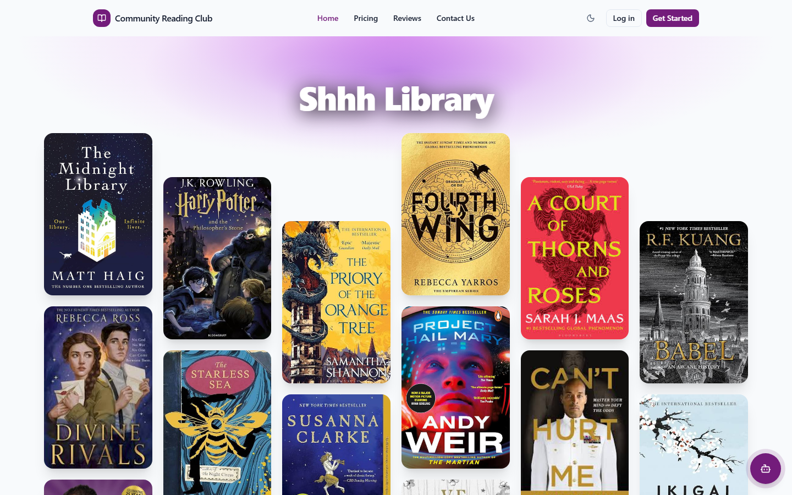
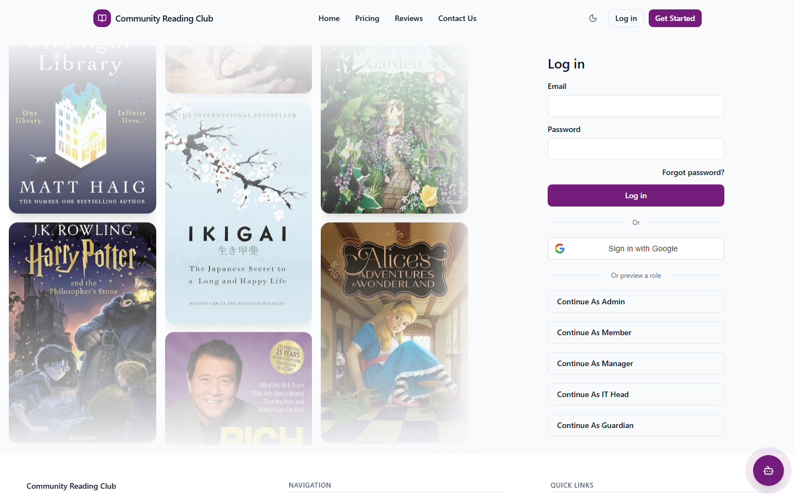
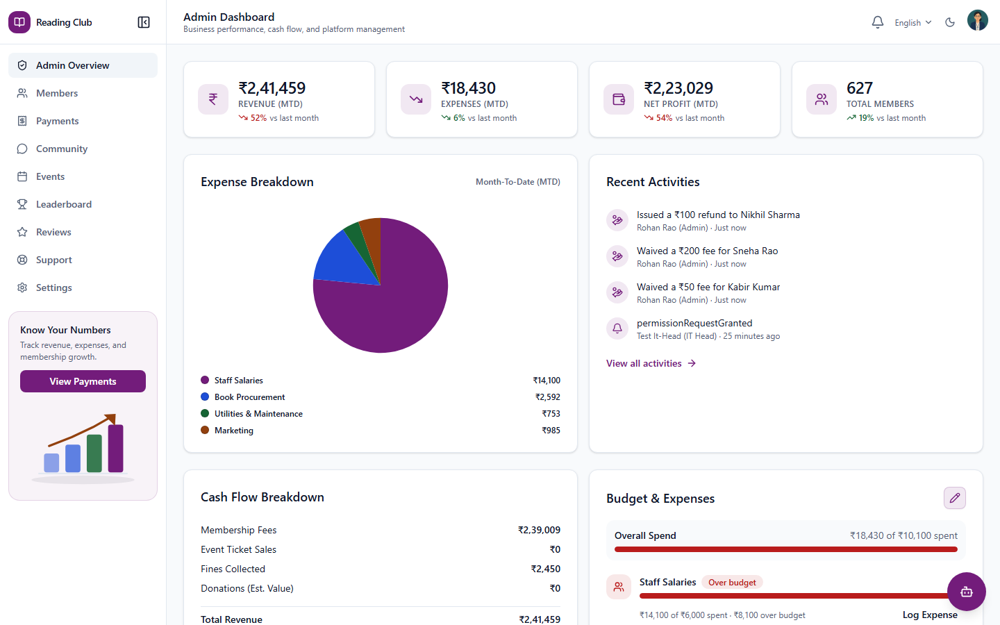
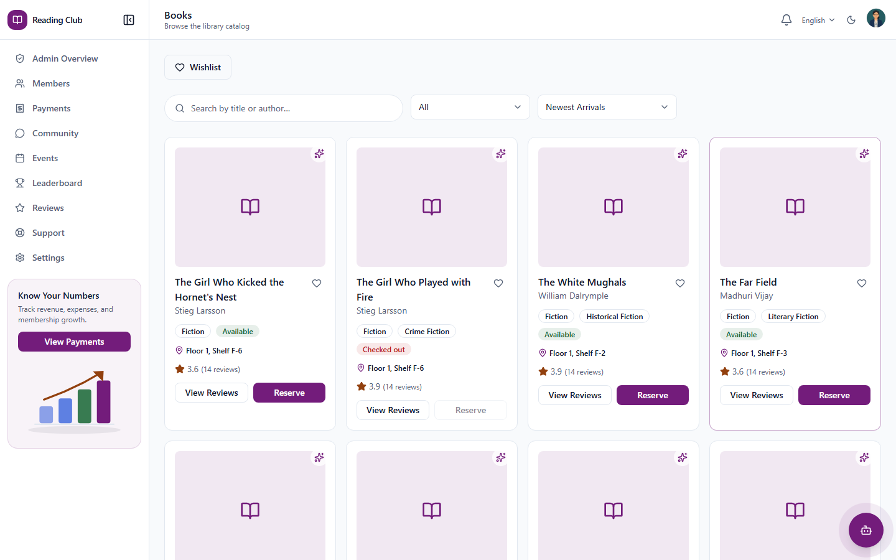
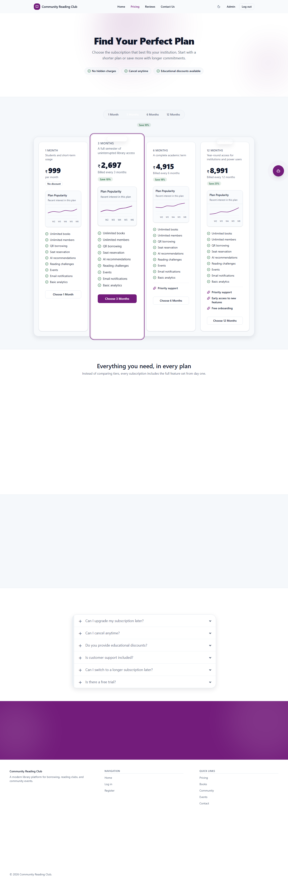
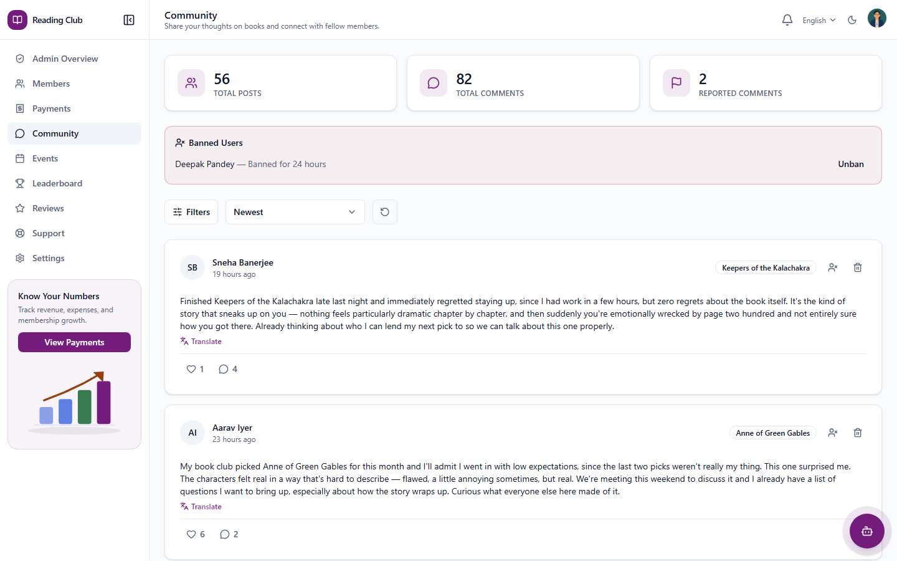
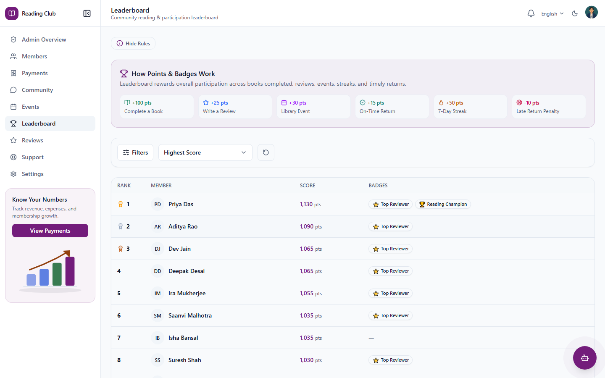
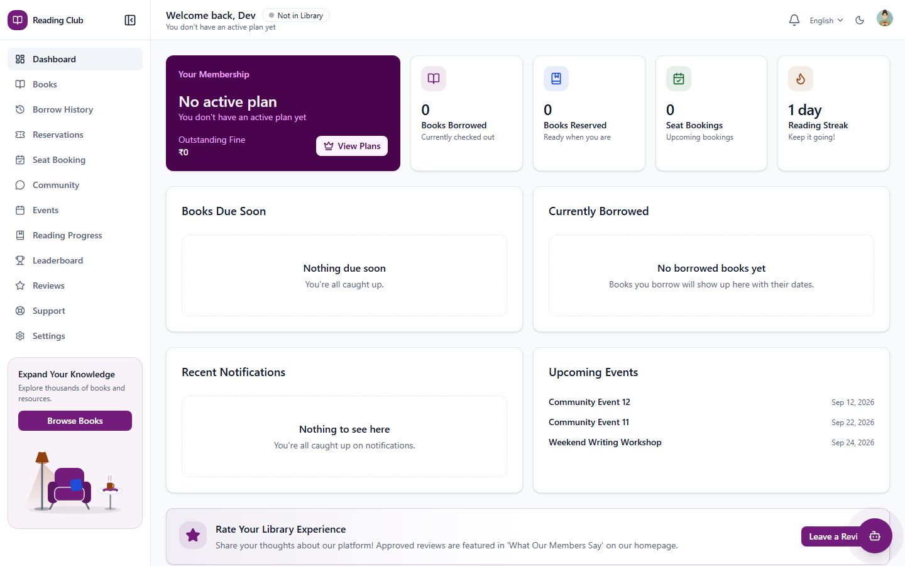

# UI Screenshots

A quick visual tour of the app, captured from a running local instance (seeded demo
data, dev-preview accounts). See the [README](../README.md) for setup instructions.

## Landing Page

## Login

Role-based dev-preview sign-in for local testing, alongside normal email/password and
Google login.

## Admin Dashboard

Revenue, expenses, membership growth, and recent activity at a glance.

## Books Catalog

Search, filter, and reserve from the shared catalog.

## Pricing

## Community

Reading-club discussions and reviews.

## Leaderboard

## Member Dashboard

The everyday view for a regular member — active loans, reading progress, and quick
actions.

