# UI Screenshots

A quick visual tour of the app, captured from a running local instance (seeded demo
data, dev-preview accounts). See the [README](../README.md) for setup instructions.

## Landing Page

The public marketing page — no login required. Book covers, hero copy, and nav links
are served straight from `(public)/page.tsx`; "Get Started" and "Log in" are the only
gates into the rest of the app.

## Login

Role-based dev-preview sign-in for local testing, alongside normal email/password and
Google login.

Normal sign-in is email/password (bcrypt-hashed) or Google OAuth token verification.
The "Continue as \<role\>" buttons are a dev-only shortcut that log straight into a
seeded preview account per role, without needing its password.

## Admin Dashboard

Revenue, expenses, membership growth, and recent activity at a glance.

Every number here — revenue, expenses, member count — is computed live from the same
`Payment`/`Expense`/`User` tables the rest of the app writes to; there's no separate
analytics pipeline.

## Books Catalog

Search, filter, and reserve from the shared catalog.

Search/filter/sort run as one paginated query against the `Book` table; "Reserve"
creates a `Reservation` row if the title is available, or joins the wait queue if every
copy is already on loan.

## Pricing

Plans (1/3/6/12 months) are seeded rows in the `PricingPlan` table, not hardcoded UI —
an admin can edit prices and discounts without a deploy. Checkout hands off to Razorpay.

## Community

Reading-club discussions and reviews.

A shared feed of posts/comments tied to books, with likes, saves, and staff moderation
(report/ban) — post and comment counts shown are live aggregates, not cached copy.

## Leaderboard

Points accrue automatically from other actions across the app — finishing a book
(+100), writing a review (+25), attending an event (+30), returning on time (+15), a
7-day streak (+50), or a late return (−10) — there's no separate place to "earn points."

## Member Dashboard

The everyday view for a regular member — active loans, reading progress, and quick
actions.

Pulls together this one member's active loans, upcoming due dates, outstanding fines,
seat bookings, and reading streak into a single query, so nothing here requires
navigating to another page just to check status.

## Manager Dashboard

Front-desk operations — checking members in/out, and today's activity at a glance.

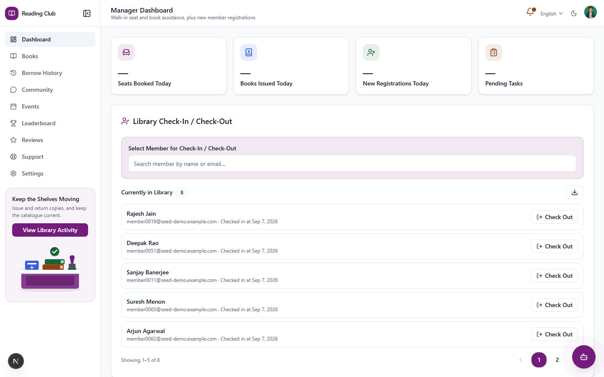

Search-and-check-in writes a `LibraryVisit` row with an entry timestamp; "Check Out"
closes it with an exit timestamp — this is the data source behind the Guardian
dashboard's "currently in library" status for a linked child.

## Guardian Dashboard

A guardian's view of every linked child's activity, dues, and reading progress.

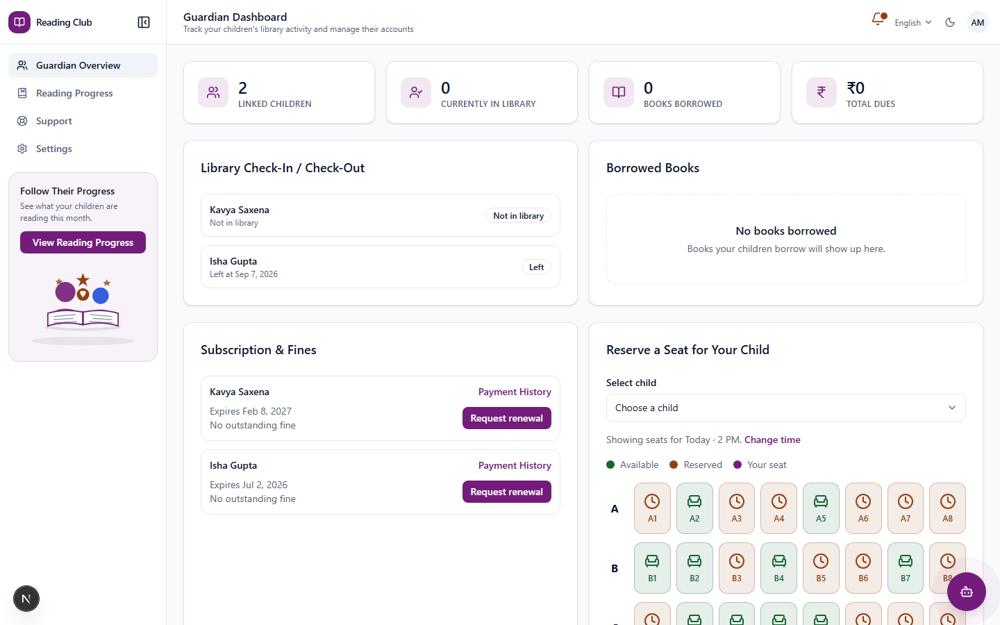

A `GuardianLink` row ties a guardian account to a member account server-side; the
guardian can view activity, pay fines, or reserve a seat for the child without ever
seeing the child's own login credentials.

## IT Head Reports

Financial activity, expense approvals, and generated operational reports.

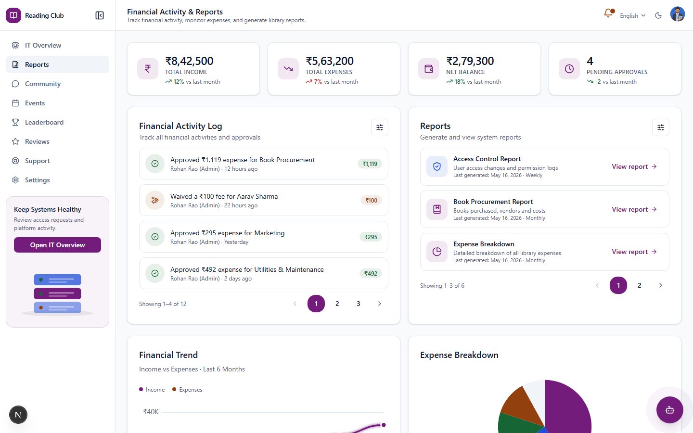

Same underlying financial data as the Admin dashboard, reshaped into exportable
reports (access control, procurement, expense breakdown) — a separate view for a
separate audience, not a separate system.

## Seat Booking

Reserve a study seat for a specific date and time slot.

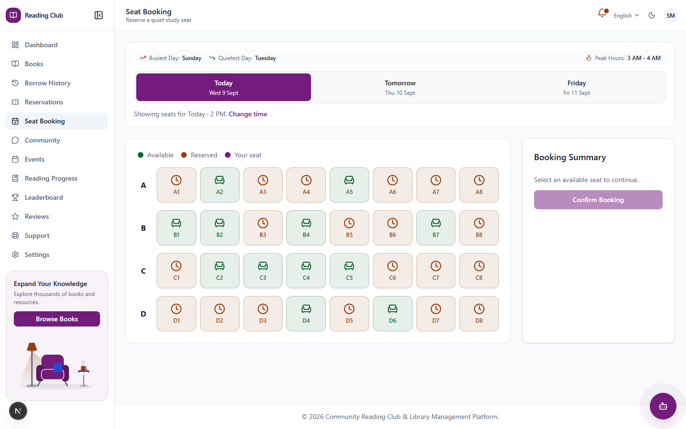

Seats are booked per date+time-slot combination with a database-level uniqueness
constraint on (member, seat, slot) — two people genuinely can't double-book the same
seat, it's not just a UI check.

## Reservations

Track your book borrow requests.

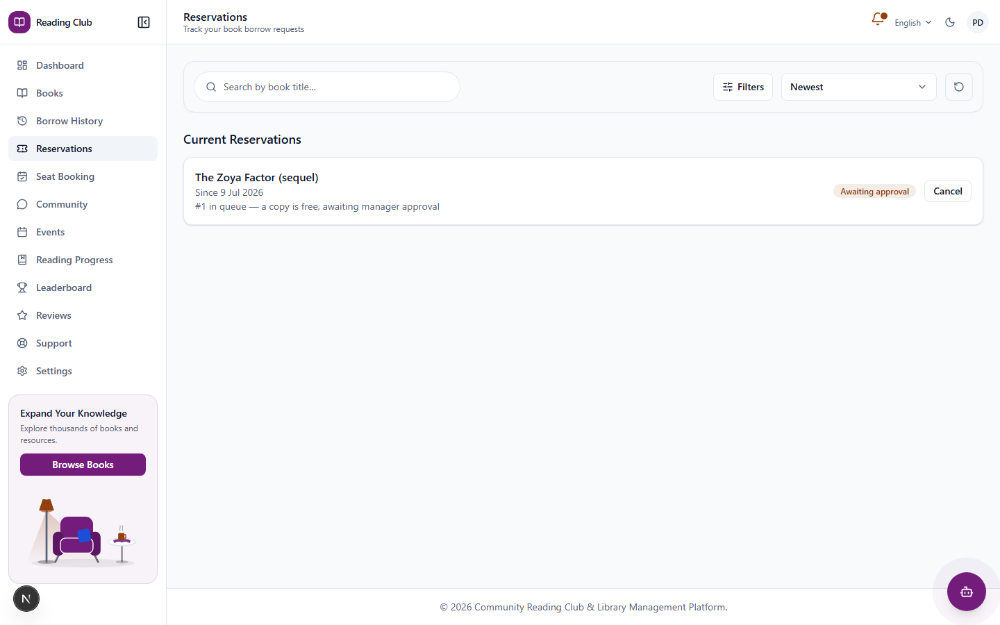

When every copy of a title is checked out, requesting to borrow creates a queued
`Reservation` instead of a `Loan`; staff approve it into an actual loan once a copy is
returned, which is why it shows "awaiting manager approval" above.

## Reading Progress

Yearly reading goals, streaks, and book status.

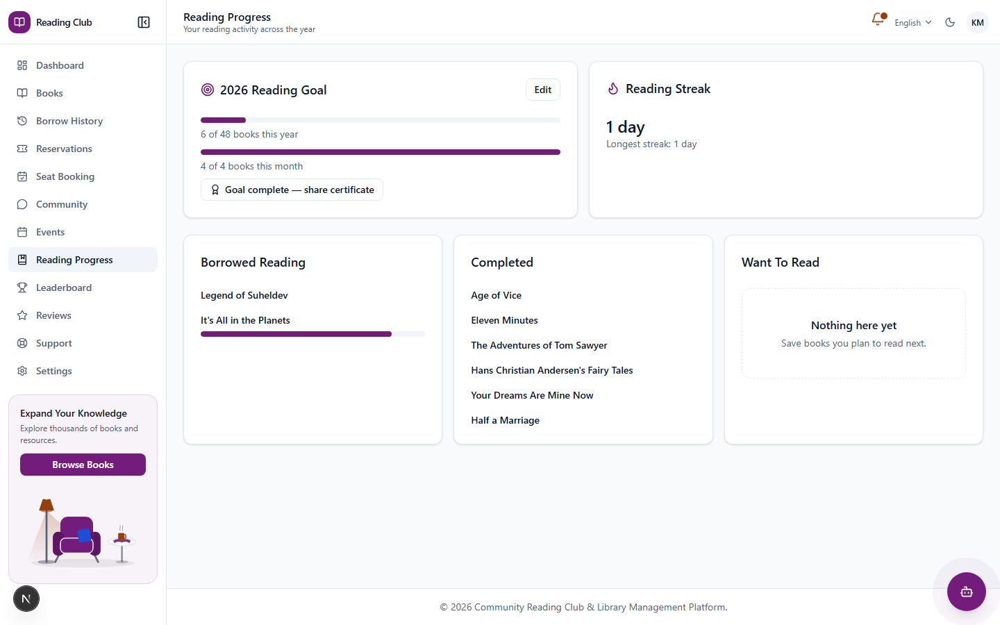

Marking a book "completed" here is what actually awards the +100 leaderboard points
and updates the reading streak — the Leaderboard page is just a read-only view of
totals this page (and reviews/events) produces.

## Events

Library-run events and community programs.

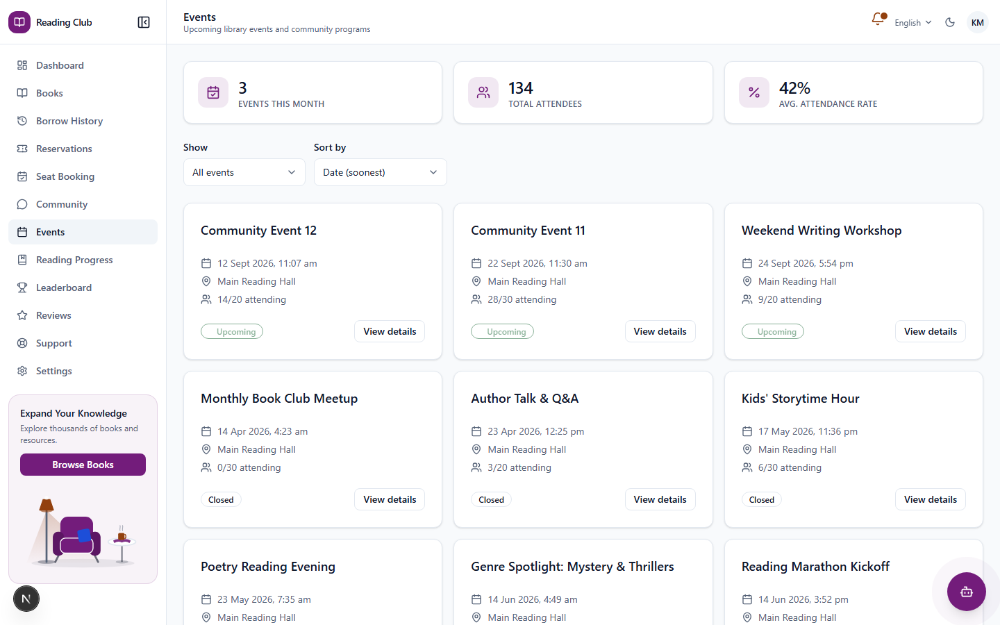

Each event tracks its own capacity and live RSVP count (`EventRegistration` rows);
registering both books your seat and adds points to your leaderboard total.

## Book Detail & AI Insights

AI-generated summary, difficulty rating, and themes for a book.

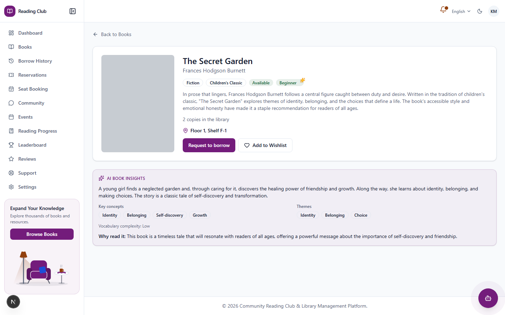

Generated once per book by the configured LLM (OpenAI, AWS Bedrock, or local Ollama)
and cached on the `Book` row — instant on every later visit, and only regenerated if
the book's title/author/category/description is edited.

## AI Chatbot (Shelfie)

A library assistant that answers using live account and catalog data.

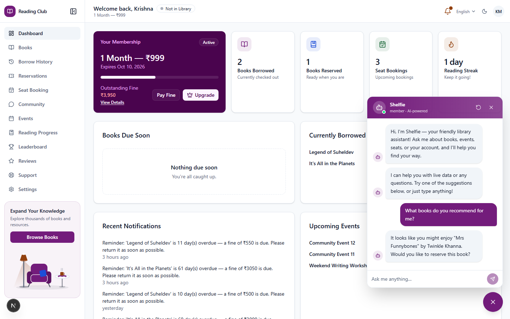

Shelfie is a LangGraph ReAct agent with ~27 callable tools (search books, check seat
availability, look up loans/fines, register for events, ...) — it calls a tool to
fetch real data for nearly every question rather than answering from the model's own
memory, so its answers stay grounded in what's actually in the database.

## Admin Payments

Every payment on record, across all members.

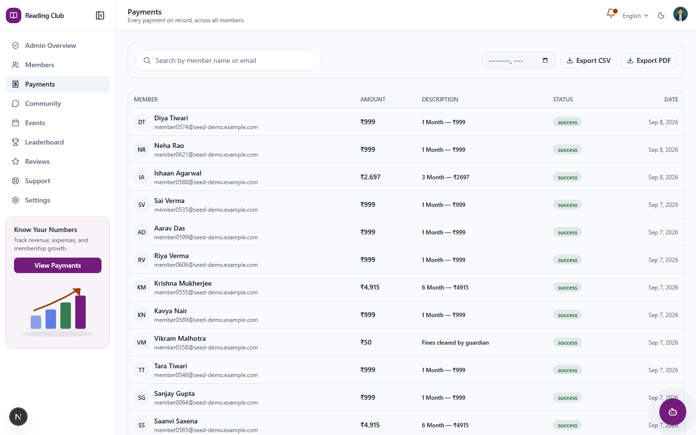

A ledger view over every Razorpay-processed transaction (memberships, renewals, fines)
across all members, with CSV/PDF export for accounting.

## AI Reading Profile

A personal snapshot of a member's taste, generated from their own activity.

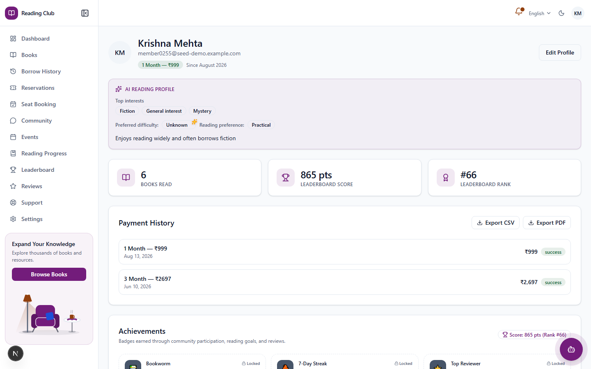

Built by the LLM from that member's own loans, reviews, and reading progress (not a
fixed questionnaire) — it stays cached on the `User` row and quietly regenerates once
enough new activity has piled up, so it drifts as taste changes instead of going stale.

## AI Reviews Digest

A one-paragraph summary of what everyone's saying about a book.

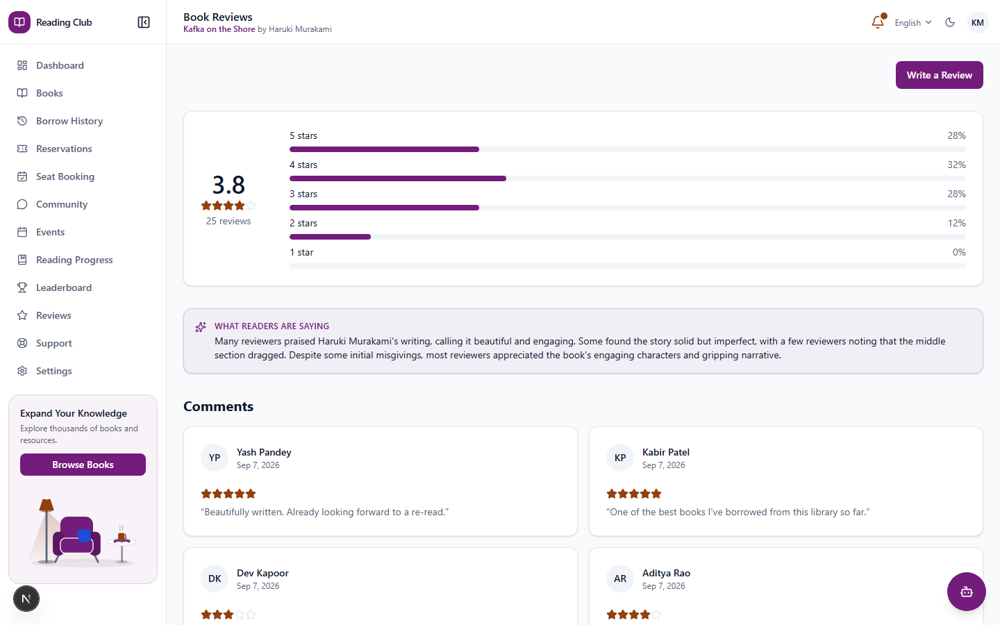

Summarizes every review left on a book into a couple of sentences; cached per book and
invalidated once enough new reviews come in, so it doesn't re-run on every page view.

## AI Book Recommendations

"Find My Next Book" — describe a mood and get matches from the real catalog.

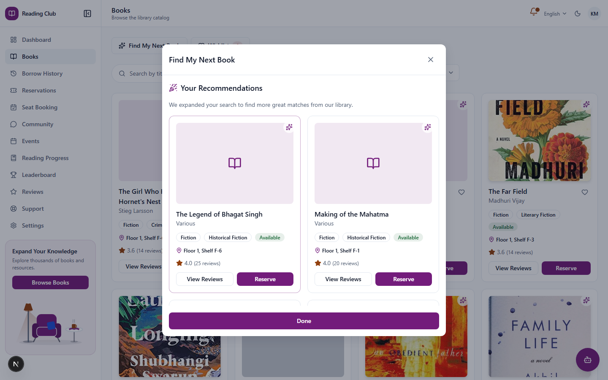

Free-text ("cozy mystery, short read") or a 30-second quiz both feed the same engine:
it embeds the request and ranks it against real book embeddings, so results are always
titles actually in this library's catalog, never invented ones.

## AI Translate

Live translation of any text into 12 Indian languages.

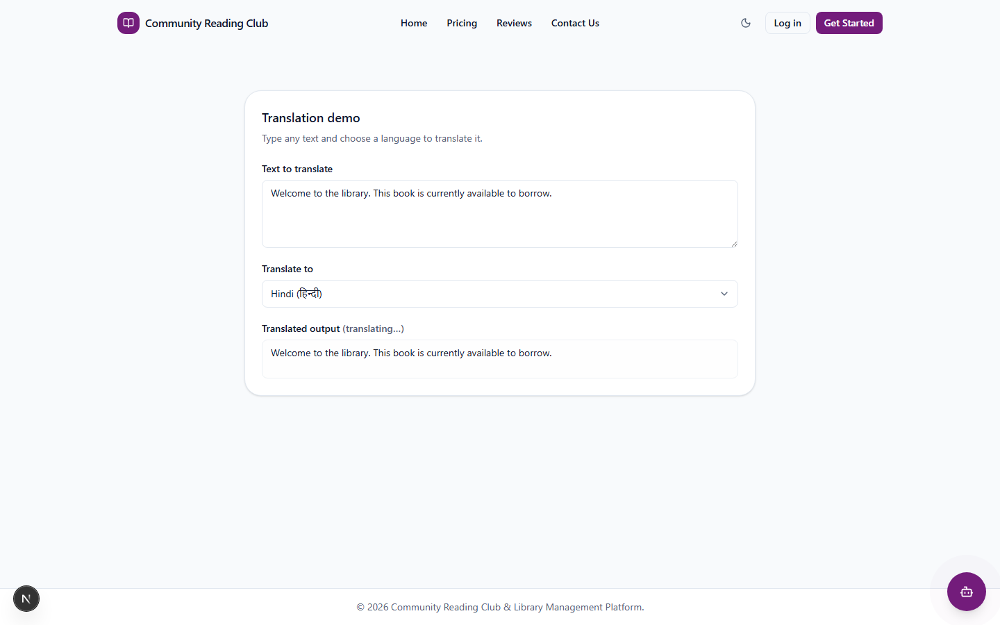

A thin wrapper around the same configured LLM — no separate translation API — used
here as a standalone demo, and inline on community posts via a "Translate" link.

## AI-Suggested Book Description

Staff adding a book can auto-draft its catalog description from just the title/author.

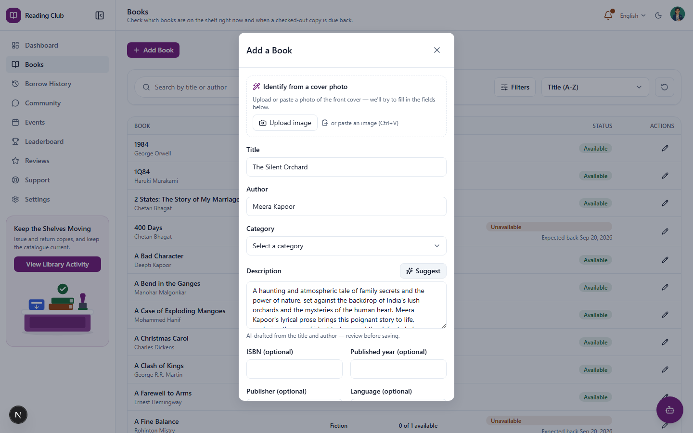

One LLM call drafts a description from title + author for staff to edit before saving —
never auto-published as-is. The cover photo box above it is the same modal's other AI
feature (identify a book from a photo of its cover), shown here before use.

## Manager Insights

Demand forecasting and late-return risk, computed from real borrowing history.

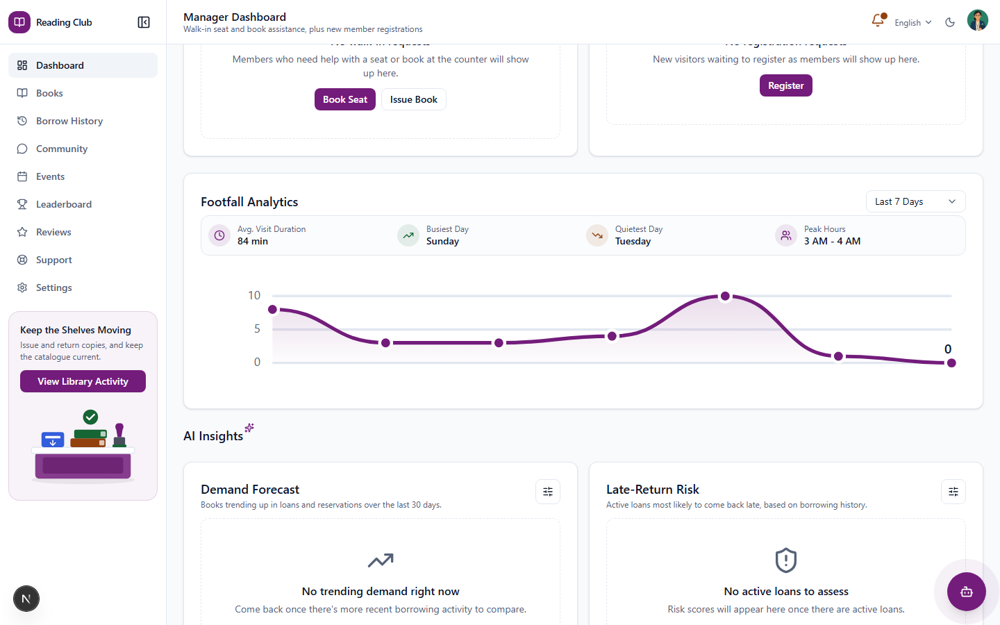

Unlike the sections above, this one isn't an LLM call — it's deterministic trend math
(this month vs. last month's loan/reservation counts) labeled "AI Insights" in the UI.
Empty here because there's no notable trend in the current 30-day window of seeded data.

## Wishlist

Save books to come back to later.

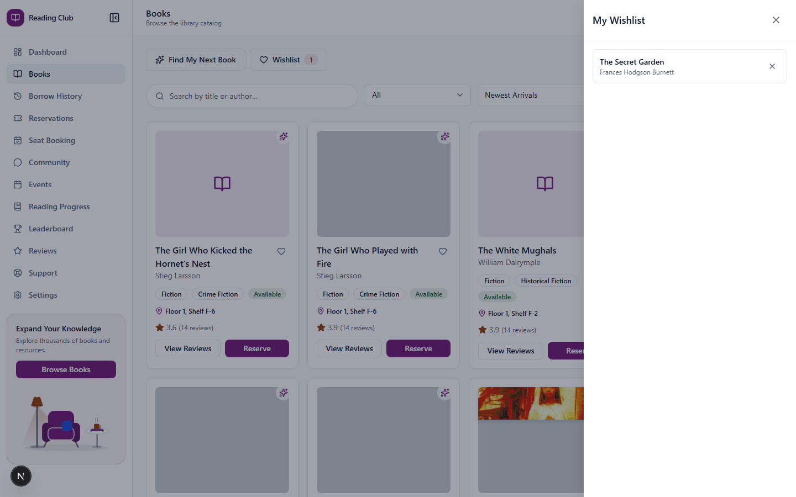

A plain many-to-many save list (`Wishlist` rows) between member and book — no
recommendation logic involved, just "remember this for later."

## Borrow History

A member's full record of past and current loans.

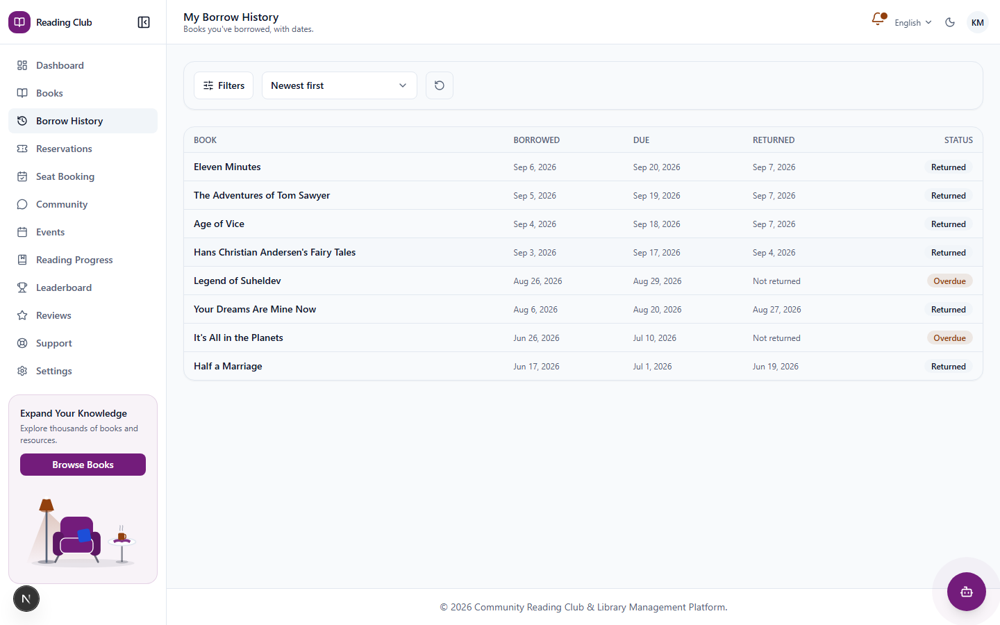

Every `Loan` ever issued to this member, oldest to newest, including ones still
outstanding — the Member Dashboard only shows what's active right now, this shows all
of it.

## Admin Members

Every registered account, their plan, and their standing, in one table.

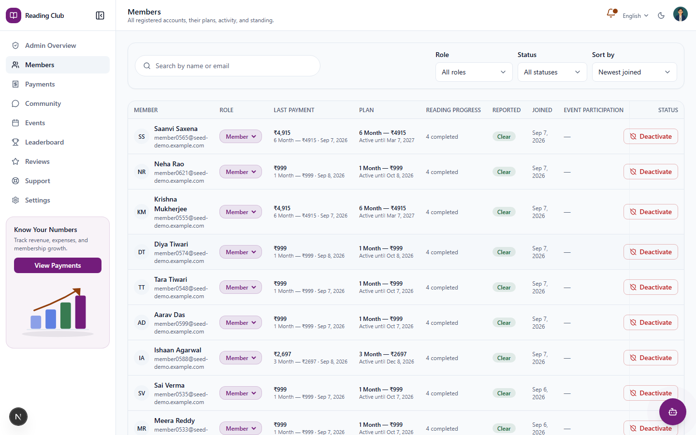

The one place an admin can see plan status, reading progress, and reported-content
history side by side per member, and deactivate an account directly from the row.

## Support Tickets

Issues raised by members and guardians, triaged by staff.

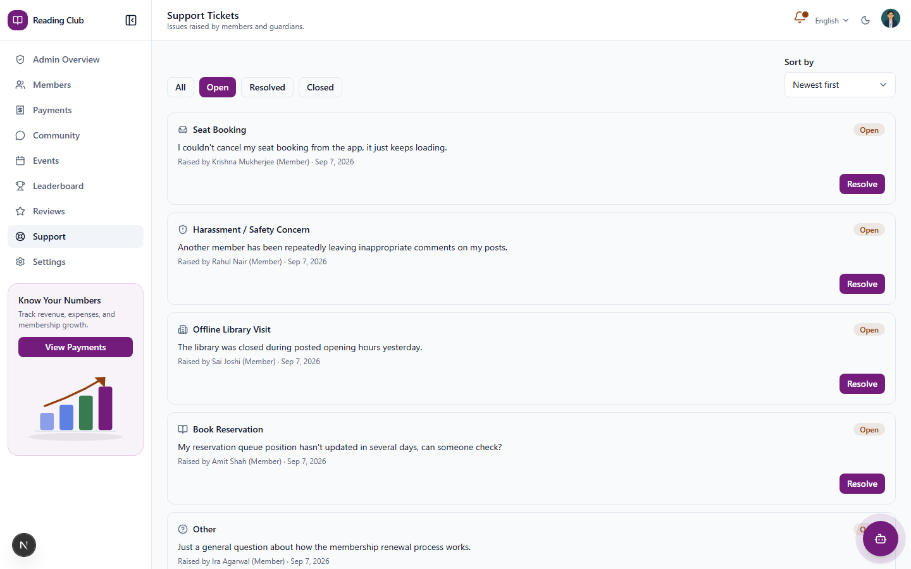

A plain ticket queue (open/resolved/closed) tied to the member who raised it — no AI
involved here, just a support inbox built into the same app.
